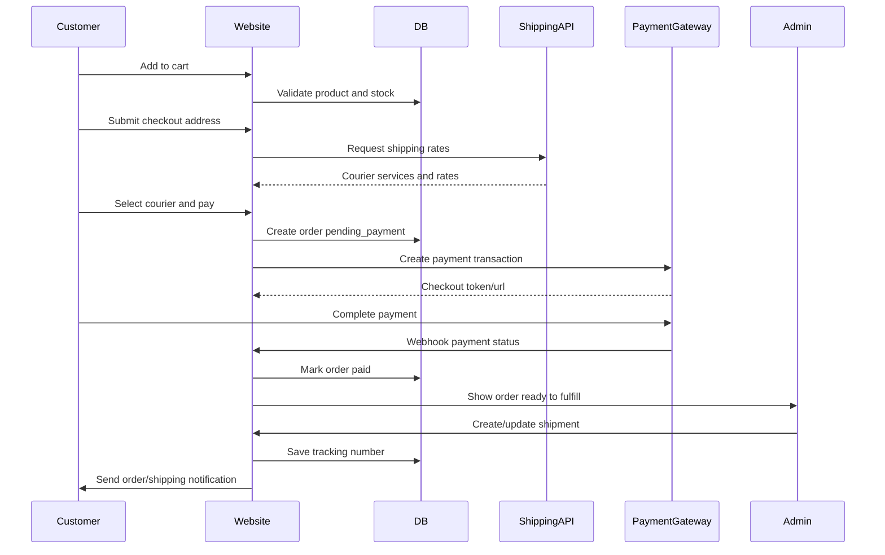

# Requirement Checkout dan Shipping Tallownara

Terakhir diperbarui: 10 Mei 2026  
Scope: persiapan agar website `https://www.tallownara.com/` dapat menerima transaksi langsung tanpa mengalihkan pembeli ke marketplace/e-commerce lain.

## Ringkasan Eksekutif

Website Tallownara saat ini berfungsi sebagai brand site dan katalog produk. Produk sudah tampil di halaman Home dan Shop, tetapi tombol keranjang masih mengarah ke Shopee. Belum ada data produk terpusat, halaman detail produk, cart internal, checkout, pembayaran, order management, perhitungan ongkir, integrasi kurir, maupun dashboard fulfillment.

Untuk menjual langsung dari website, Tallownara perlu menyiapkan tiga area besar:

1. **Fondasi commerce**: katalog produk dengan SKU, stok, harga, berat/dimensi, cart, checkout, order, payment, shipping, notifikasi, dan admin order.
2. **Operasional bisnis**: SOP packing, pickup/dropoff kurir, handling stok, refund/return, customer service, invoice/resi, rekonsiliasi pembayaran, dan kebijakan pengiriman.
3. **Compliance dan trust**: kebijakan privasi, syarat & ketentuan, kebijakan refund/return, data pribadi pelanggan, keamanan pembayaran, informasi legal usaha, dan informasi produk yang konsisten dengan klaim skincare/BPOM.

Rekomendasi pendekatan MVP: gunakan payment gateway hosted checkout seperti Midtrans Snap atau Xendit Checkout, gunakan shipping aggregator/rate API seperti Biteship atau RajaOngkir untuk ongkir, dan bangun backend order internal di Next.js dengan database relasional.

## Kondisi Website Saat Ini

### Temuan dari website publik

- Halaman utama menampilkan brand hero, tiga produk unggulan, ritual guide, dan footer.
- Halaman `/shop` menampilkan tiga produk:
  - NEW FORMULA Luxury Grassfed Beef Tallow Balm with Calendula Herbs, Rp 50.700, BPOM NA18250118219.
  - Tallow Balm Multifungsi Pelembab Alami Grass Fed, Rp 33.900.
  - Nourishing Tallow Liquid Soap, Sabun Tallow Kastil Alami, Rp 40.000, BPOM NA18250702788.
- Halaman contact menampilkan email `hello@tallownara.com`, nomor telepon, alamat Cibinong/Bogor, dan form kontak statis.
- Footer menampilkan link kebijakan, tetapi link masih placeholder.

### Temuan dari source code

- Framework: Next.js App Router, React 19.
- Katalog produk masih hardcoded di:
  - `src/components/ProductSection.jsx`
  - `src/app/shop/page.js`
  - `src/components/ProductCard.jsx`
- Tombol cart di `ProductCard` menerima `shopeeLink` dan membuka Shopee di tab baru.
- Belum ada:
  - API route untuk commerce.
  - Database atau ORM.
  - Autentikasi customer/admin.
  - Cart state.
  - Checkout page.
  - Payment callback/webhook.
  - Order table.
  - Shipping rate calculation.
  - Admin dashboard.
- Ada CSS untuk section `#cart`, tetapi belum ada halaman/cart implementation yang aktif.
- `README.md` masih template React + Vite, belum menggambarkan project Next.js saat ini.

## Target Pengalaman Pengguna

Pembeli harus dapat menyelesaikan alur ini di website Tallownara:

1. Melihat daftar produk.
2. Membuka detail produk.
3. Memilih varian/jumlah.
4. Menambahkan produk ke cart.
5. Mengisi data penerima dan alamat.
6. Melihat pilihan kurir, estimasi ongkir, dan estimasi durasi pengiriman.
7. Memilih metode pembayaran.
8. Membayar melalui gateway.
9. Mendapat halaman sukses/pending/gagal yang jelas.
10. Menerima notifikasi order dan update resi.
11. Mengecek status pesanan melalui link order lookup atau akun customer.

## Requirement Bisnis yang Perlu Disiapkan

### Produk dan Inventory

Setiap produk perlu data minimal berikut:

- SKU unik.
- Nama produk.
- Slug URL.
- Kategori.
- Deskripsi singkat dan panjang.
- Harga jual.
- Harga diskon jika ada.
- Status publish: draft, active, archived.
- Foto utama dan galeri.
- Nomor BPOM jika ada.
- Klaim keamanan, misalnya aman untuk bumil/busui/bayi, dengan dasar copy yang disetujui.
- Berat aktual per item.
- Dimensi packing per item.
- Berat volumetrik jika relevan.
- Stok tersedia.
- Stok tertahan untuk pesanan belum dibayar.
- Batas pembelian minimal/maksimal.
- Varian jika ada, misalnya ukuran, aroma, bundle, atau paket isi.

Keputusan yang perlu dibuat:

- Apakah stok akan dikelola di website sebagai source of truth atau tetap dikelola manual dari operasional.
- Apakah produk marketplace dan website memakai stok yang sama.
- Apakah website boleh oversell saat stok rendah.
- Apakah bundle dihitung sebagai SKU sendiri atau komposisi beberapa SKU.

### Harga, Promo, dan Pajak

Perlu diputuskan sejak awal:

- Harga sudah termasuk pajak atau belum.
- Apakah ada PPN, invoice pajak, atau kebutuhan faktur tertentu.
- Aturan diskon: kode voucher, diskon produk, diskon subtotal, gratis ongkir.
- Aturan minimum order.
- Aturan biaya tambahan: packaging, COD fee, payment fee, insurance.
- Pembulatan nominal agar sesuai dengan payment gateway.

MVP bisa mulai dengan harga final tanpa voucher. Voucher dan promo bisa menjadi fase berikutnya.

### Customer Service dan Operasional Pesanan

Tallownara perlu menyiapkan SOP untuk:

- Jam cutoff order harian.
- Estimasi packing.
- Kondisi pesanan yang bisa dibatalkan.
- Kondisi refund.
- Prosedur return/exchange.
- Penanganan paket rusak/hilang.
- Penanganan alamat tidak lengkap.
- Penanganan pembayaran pending/expired.
- Channel bantuan: WhatsApp, email, atau form order support.

## Requirement Fungsional

### Product Catalog

MVP:

- Produk dibaca dari data terstruktur, bukan hardcoded di komponen UI.
- Halaman `/shop` menampilkan produk aktif.
- Halaman `/products/[slug]` menampilkan detail produk.
- Produk yang stoknya habis diberi status jelas dan tidak bisa ditambahkan ke cart.
- Harga disimpan sebagai integer dalam rupiah, bukan string display.
- Image produk menggunakan asset terstruktur.

Fase berikutnya:

- Filter kategori.
- Search.
- Sort by newest, price, best seller.
- Related products.
- Product review.

### Cart

MVP:

- Tombol cart menambahkan produk ke cart internal, bukan membuka Shopee.
- Cart dapat menyimpan beberapa item.
- Customer dapat mengubah kuantitas.
- Customer dapat menghapus item.
- Cart menampilkan subtotal.
- Cart tetap tersimpan saat refresh browser.
- Validasi stok dilakukan saat add to cart dan sebelum checkout.

Catatan teknis:

- Cart guest bisa disimpan di cookie/local storage untuk MVP.
- Saat order dibuat, server tetap harus menghitung ulang harga, stok, berat, dan subtotal agar data client tidak dipercaya langsung.

### Checkout

MVP checkout perlu berisi:

- Ringkasan item.
- Form data penerima:
  - Nama penerima.
  - Nomor WhatsApp/telepon.
  - Email.
  - Alamat lengkap.
  - Provinsi.
  - Kota/kabupaten.
  - Kecamatan.
  - Kelurahan/desa bila diperlukan provider ongkir.
  - Kode pos.
  - Catatan pengiriman.
- Pilihan shipping method.
- Ringkasan biaya:
  - Subtotal produk.
  - Ongkir.
  - Diskon jika ada.
  - Biaya tambahan jika ada.
  - Total pembayaran.
- Persetujuan terhadap Syarat & Ketentuan, Kebijakan Privasi, dan Kebijakan Pengiriman.
- Tombol bayar.

Validasi:

- Email valid.
- Nomor telepon format Indonesia.
- Alamat tidak kosong.
- Kode pos valid.
- Pilihan kurir tersedia.
- Total order dihitung ulang di server.

### Payment

MVP:

- Payment gateway membuat transaksi berdasarkan order yang sudah dibuat di server.
- Customer diarahkan ke hosted payment/checkout popup.
- Website menerima webhook/notification dari payment gateway.
- Status order berubah otomatis:
  - `pending_payment`
  - `paid`
  - `payment_failed`
  - `expired`
  - `cancelled`
- Halaman sukses/pending/gagal harus membaca status order dari server, bukan hanya callback frontend.
- Order ID harus unik dan konsisten antara database Tallownara dan gateway.

Opsi gateway:

- **Midtrans Snap**: cocok untuk integrasi cepat karena menyediakan UI pembayaran hosted/popup dan mendukung banyak metode pembayaran melalui satu integrasi.
- **Xendit**: alternatif payment gateway dengan checkout/payment channel yang luas.

Data yang perlu disiapkan untuk payment onboarding:

- Legalitas usaha.
- Nama merchant.
- Rekening settlement.
- Email/nomor operasional.
- Domain produksi.
- URL callback/notification produksi.
- Dokumen KYC/KYB sesuai permintaan gateway.
- Daftar metode pembayaran yang ingin diaktifkan: VA, QRIS, e-wallet, kartu, retail outlet, dan lainnya.

### Shipping dan Ongkir

MVP:

- Ongkir dihitung berdasarkan origin, destination, berat, dimensi, dan courier service.
- Customer dapat memilih kurir/service sebelum bayar.
- Ongkir yang dipilih disimpan pada order.
- Berat order dihitung dari total berat item dan packaging.
- Jika rate API gagal, checkout memberi pesan jelas dan tidak melanjutkan pembayaran dengan ongkir kosong.
- Setelah payment `paid`, admin dapat membuat shipment/resi atau sistem dapat membuat shipment otomatis jika provider mendukung.

Opsi integrasi:

- **Biteship**: aggregator shipping API untuk rate, shipment/order, tracking, dan multi-carrier.
- **RajaOngkir**: umum dipakai untuk cek ongkir/rate. Perlu dicek paket API dan cakupan endpoint yang dibutuhkan.
- Integrasi langsung kurir: JNE, J&T, SiCepat, AnterAja, POS, dan lainnya. Ini biasanya lebih berat secara onboarding dan maintenance.

Data origin yang perlu disiapkan:

- Nama pengirim.
- Nomor telepon pengirim.
- Alamat pickup/dropoff lengkap.
- Kota/kabupaten.
- Kecamatan.
- Kode pos.
- Koordinat jika provider memakai latitude/longitude.
- Jadwal pickup.
- Daftar kurir yang diaktifkan.

Keputusan operasional:

- Pakai pickup otomatis atau dropoff manual.
- Resi dibuat otomatis setelah pembayaran atau manual oleh admin.
- Apakah customer boleh memilih asuransi.
- Apakah pengiriman hanya Indonesia atau juga internasional.
- Apakah ongkir subsidi/gratis ongkir akan ditanggung toko.

### Order Management

MVP admin perlu bisa:

- Melihat daftar order.
- Filter by status pembayaran dan status fulfillment.
- Membuka detail order.
- Melihat item, alamat, payment status, shipping method, total, dan catatan.
- Mengubah fulfillment status:
  - `unfulfilled`
  - `ready_to_pack`
  - `packed`
  - `shipped`
  - `delivered`
  - `returned`
- Mengisi atau menerima nomor resi.
- Mengirim notifikasi resi ke customer.
- Membatalkan order jika belum dibayar atau sesuai SOP.

Fase berikutnya:

- Print packing slip.
- Export CSV order.
- Rekonsiliasi payment settlement.
- Partial refund.
- Admin role/permission.

### Notifikasi

MVP:

- Email atau WhatsApp untuk order created.
- Email atau WhatsApp untuk payment paid.
- Email atau WhatsApp untuk shipped/resi.
- Email atau WhatsApp untuk order cancelled/expired.
- Template notifikasi harus memakai bahasa brand Tallownara dan mencantumkan nomor order.

Keputusan:

- Channel utama: email, WhatsApp Business API, atau WhatsApp manual.
- Provider email: Resend, SendGrid, Mailgun, SES, atau provider lain.
- Provider WhatsApp: Meta Cloud API atau BSP lokal.

## Requirement Non-Fungsional

### Keamanan

- Jangan menyimpan data kartu pembayaran di server Tallownara.
- Payment secret/API key hanya disimpan di environment variable server.
- Webhook harus diverifikasi dengan signature/token dari provider.
- Semua mutasi order hanya dilakukan server-side.
- Rate limit endpoint checkout dan webhook.
- Proteksi admin dengan autentikasi kuat.
- Audit log untuk perubahan status order.
- Backup database otomatis.
- HTTPS wajib di production.

### Reliability

- Webhook payment harus idempotent.
- Order tidak boleh double-paid karena retry webhook.
- Payment callback frontend tidak boleh menjadi satu-satunya sumber kebenaran.
- Jika create shipment gagal setelah payment sukses, order tetap tersimpan sebagai paid dan masuk antrian fulfillment manual.
- Log error untuk payment, shipping rate, dan shipment creation.

### Performance

- Halaman katalog dan detail produk harus tetap cepat.
- Data shipping rate hanya dihitung di checkout, bukan di listing produk.
- Image produk dioptimalkan dengan Next.js Image bila memungkinkan.

### Accessibility dan Mobile

- Checkout harus mobile-first.
- Field error harus jelas dan bisa dibaca screen reader.
- Tombol bayar harus disabled saat data belum valid.
- Ringkasan order tetap mudah dibaca pada layar kecil.

## Model Data Awal

Skema minimum yang disarankan:

```text
Product
- id
- sku
- slug
- name
- category
- description
- price_amount
- currency
- bpom_number
- is_safe_for_pregnant_breastfeeding_baby
- weight_grams
- length_cm
- width_cm
- height_cm
- stock_quantity
- status
- created_at
- updated_at

ProductImage
- id
- product_id
- url
- alt
- sort_order

Cart
- id
- customer_id nullable
- guest_token nullable
- created_at
- updated_at

CartItem
- id
- cart_id
- product_id
- quantity
- price_snapshot_amount

Order
- id
- order_number
- customer_email
- customer_phone
- recipient_name
- shipping_address_json
- subtotal_amount
- shipping_amount
- discount_amount
- total_amount
- currency
- payment_status
- fulfillment_status
- shipping_status
- created_at
- updated_at

OrderItem
- id
- order_id
- product_id
- sku_snapshot
- name_snapshot
- price_snapshot_amount
- quantity
- weight_snapshot_grams

Payment
- id
- order_id
- provider
- provider_transaction_id
- provider_order_id
- snap_token_or_checkout_url
- status
- raw_payload_json
- paid_at
- expires_at
- created_at
- updated_at

Shipment
- id
- order_id
- provider
- courier_code
- courier_service
- tracking_number
- shipping_rate_id
- origin_json
- destination_json
- status
- shipped_at
- delivered_at
- raw_payload_json
- created_at
- updated_at
```

## Arsitektur Teknis yang Disarankan

### Pilihan Stack

Website sudah menggunakan Next.js, sehingga implementasi commerce bisa dibangun bertahap di stack yang sama:

- Next.js App Router untuk halaman dan API routes.
- PostgreSQL untuk database.
- Prisma atau Drizzle untuk ORM.
- Payment gateway hosted checkout.
- Shipping API provider.
- Email/WhatsApp notification provider.
- Admin sederhana di route protected, misalnya `/admin/orders`.

### Flow Checkout



### Status Order

Payment status:

- `pending_payment`
- `paid`
- `failed`
- `expired`
- `refunded`

Fulfillment status:

- `unfulfilled`
- `ready_to_pack`
- `packed`
- `shipped`
- `delivered`
- `returned`
- `cancelled`

Shipping status:

- `not_created`
- `rate_selected`
- `shipment_created`
- `picked_up`
- `in_transit`
- `delivered`
- `failed_delivery`
- `returned`

## Halaman yang Perlu Dibangun

Customer-facing:

- `/shop`
- `/products/[slug]`
- `/cart`
- `/checkout`
- `/checkout/success`
- `/checkout/pending`
- `/checkout/failed`
- `/orders/[orderNumber]` atau `/track-order`
- `/shipping-policy`
- `/return-refund-policy`
- `/privacy-policy`
- `/terms-and-conditions`

Admin-facing:

- `/admin/login`
- `/admin/orders`
- `/admin/orders/[id]`
- `/admin/products`
- `/admin/products/[id]`

API routes:

- `GET /api/products`
- `GET /api/products/[slug]`
- `POST /api/cart/items`
- `PATCH /api/cart/items/[id]`
- `DELETE /api/cart/items/[id]`
- `POST /api/checkout/rates`
- `POST /api/orders`
- `POST /api/payments/create`
- `POST /api/webhooks/payment/[provider]`
- `POST /api/shipments`
- `POST /api/webhooks/shipping/[provider]`

## Dokumen Legal dan Kebijakan yang Perlu Disiapkan

Minimal sebelum go-live:

- Syarat & Ketentuan.
- Kebijakan Privasi.
- Kebijakan Pengiriman.
- Kebijakan Pembatalan, Return, dan Refund.
- Disclaimer produk skincare.
- Informasi kontak CS.
- Informasi legal usaha bila tersedia.
- Persetujuan pemrosesan data pribadi saat checkout.

Catatan: bagian ini perlu ditinjau oleh pihak legal/akuntansi. Dokumen ini bukan nasihat hukum.

## Kepatuhan dan Regulasi

Hal-hal yang perlu diperhatikan untuk konteks Indonesia:

- PMSE mengatur perdagangan melalui sistem elektronik, termasuk informasi transaksi, kontrak elektronik, pembayaran, pengiriman barang, data pribadi, pembatalan, dan penyelesaian sengketa.
- Website akan mengumpulkan data pribadi seperti nama, email, nomor telepon, dan alamat, sehingga perlu kebijakan privasi, dasar pemrosesan, pembatasan akses, dan retention policy.
- Produk skincare perlu menjaga konsistensi klaim produk, nomor BPOM, komposisi, cara pakai, dan disclaimer.
- Jika memproses pembayaran melalui gateway, tetap ikuti ketentuan payment provider dan hindari menyimpan data kartu.

## Integrasi Eksternal yang Perlu Diputuskan

### Payment Gateway

Kriteria pemilihan:

- Metode pembayaran yang dibutuhkan customer Tallownara.
- Biaya transaksi.
- Kemudahan settlement dan rekonsiliasi.
- Kualitas webhook dan dashboard.
- Support sandbox.
- Dokumentasi dan SDK.
- Kemudahan refund.
- Support bisnis Indonesia.

Kandidat:

- Midtrans Snap.
- Xendit Checkout/Payment Channels.

### Shipping Provider

Kriteria pemilihan:

- Coverage area Indonesia.
- Kurir yang tersedia.
- Akurasi ongkir.
- Apakah bisa create shipment dan pickup.
- Apakah menyediakan tracking webhook.
- SLA support.
- Biaya layanan.
- Kebutuhan top-up/deposit.

Kandidat:

- Biteship untuk rate, shipment, dan tracking.
- RajaOngkir untuk cek ongkir/rate.
- Integrasi langsung kurir jika volume sudah besar.

## Roadmap Implementasi

### Fase 0: Persiapan Bisnis dan Data

Output:

- Final product master data.
- Berat dan dimensi packing per produk.
- Origin shipping address.
- Kebijakan shipping/return/privacy/terms.
- Akun payment gateway sandbox.
- Akun shipping provider sandbox.
- Keputusan metode payment dan kurir yang aktif.

### Fase 1: MVP Commerce Internal

Output:

- Data produk terpusat.
- Product detail page.
- Cart internal.
- Checkout address.
- Shipping rate calculation.
- Create order.
- Hosted payment checkout.
- Payment webhook.
- Order confirmation page.
- Admin order list/detail sederhana.
- Manual fulfillment/resi.

### Fase 2: Operasional Fulfillment

Output:

- Create shipment via provider.
- Tracking number otomatis.
- Update status shipping.
- Email/WhatsApp notification.
- Export order/packing slip.
- Rekonsiliasi settlement.

### Fase 3: Growth

Output:

- Voucher/promo.
- Bundle product.
- Customer account.
- Order history.
- Product review.
- Abandoned cart.
- Analytics funnel.
- Loyalty/referral.

## Acceptance Criteria MVP

MVP dianggap siap UAT jika:

- Customer dapat checkout satu atau lebih produk tanpa keluar ke Shopee.
- Total yang dibayar sama dengan subtotal produk + ongkir - diskon.
- Order tersimpan sebelum payment.
- Payment webhook dapat mengubah status order secara otomatis.
- Order paid muncul di admin.
- Admin dapat melihat alamat lengkap dan shipping method.
- Customer menerima instruksi/status setelah pembayaran.
- Website tidak menerima order untuk produk out of stock.
- Checkout tetap berjalan baik di mobile.
- Payment dan shipping secret tidak terekspos ke client.
- Ada halaman kebijakan dasar yang bisa diakses dari footer.

## Risiko dan Mitigasi

| Risiko | Dampak | Mitigasi |
| --- | --- | --- |
| Ongkir salah karena berat/dimensi tidak akurat | Margin rugi atau komplain customer | Timbang produk plus packaging, simpan weight/dimension per SKU |
| Webhook payment gagal | Order paid tidak terproses | Retry webhook, idempotency, dashboard manual reconciliation |
| Stok oversell | Customer membayar produk kosong | Reserve stock saat order pending, release saat expired |
| Shipment gagal dibuat otomatis | Order tertahan | Fallback fulfillment manual |
| Data pribadi bocor | Risiko legal dan trust | Minimum data collection, access control, encryption where needed, audit log |
| Klaim produk tidak konsisten | Risiko compliance dan trust | Review copy produk, BPOM, dan disclaimer sebelum publish |
| Ketergantungan provider | Checkout terganggu saat provider down | Monitoring, fallback manual, pilih provider dengan SLA baik |

## Checklist Persiapan Go-Live

- [ ] Product master data final.
- [ ] Foto produk final dan alt text.
- [ ] Berat dan dimensi packing final.
- [ ] Origin address final.
- [ ] Akun payment gateway production aktif.
- [ ] Akun shipping provider production aktif.
- [ ] Environment variables production tersimpan aman.
- [ ] Domain callback/webhook production terdaftar di provider.
- [ ] Privacy Policy publish.
- [ ] Terms & Conditions publish.
- [ ] Shipping Policy publish.
- [ ] Return/Refund Policy publish.
- [ ] SOP packing dan cutoff order disetujui.
- [ ] SOP refund/cancel disetujui.
- [ ] Admin user production dibuat.
- [ ] Test checkout sandbox end-to-end selesai.
- [ ] Test webhook success, pending, failed, expired selesai.
- [ ] Test shipping rate untuk beberapa kota selesai.
- [ ] Test mobile checkout selesai.
- [ ] Backup database aktif.
- [ ] Monitoring error aktif.

## Open Questions

- Apakah Tallownara ingin tetap mempertahankan link Shopee sebagai alternatif atau sepenuhnya checkout internal?
- Apakah stok website akan dipisah dari stok marketplace?
- Apakah pengiriman hanya dari Cibinong/Bogor?
- Kurir apa saja yang wajib tersedia saat MVP?
- Apakah ingin mendukung COD?
- Apakah customer wajib membuat akun?
- Apakah notifikasi awal cukup email atau harus WhatsApp?
- Apakah resi dibuat manual oleh admin atau otomatis via shipping provider?
- Apakah ada kebutuhan invoice/faktur pajak?
- Apakah ada rencana promo gratis ongkir saat launch?

## Referensi

- Website Tallownara: https://www.tallownara.com/
- Halaman Shop Tallownara: https://www.tallownara.com/shop
- Midtrans Snap documentation: https://docs.midtrans.com/docs/snap
- Midtrans payment notification settings: https://docs.midtrans.com/docs/payment-settings
- Xendit documentation: https://docs.xendit.co/
- Biteship API documentation: https://biteship.com/en/docs/getting-started
- Biteship courier rates API: https://biteship.com/docs/api/rates/retrieve
- RajaOngkir API documentation: https://rajaongkir.com/api/docs
- PP No. 80 Tahun 2019 tentang Perdagangan Melalui Sistem Elektronik: https://www.peraturan.go.id/id/pp-no-80-tahun-2019
